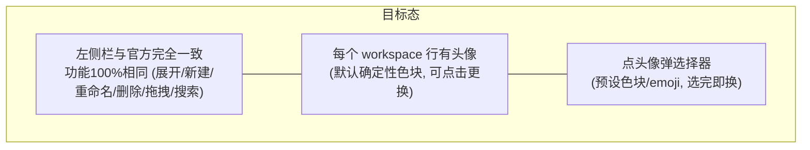
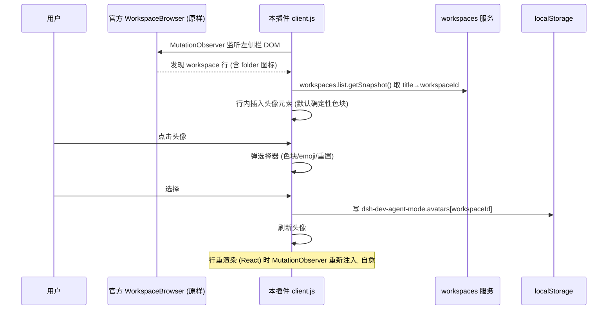

# dsh-dev-agent-mode 设计文档：左侧对话栏 Agent 模式

> 把 DeepSeek Harness 左侧对话分类栏从「按 workspace 分组」切换为「拟人化 Agent 视角」的插件设计。
> 状态：**MVP 第一步（跑通流程）**——Agent 模式 = 官方左侧栏原样 + 每个 workspace 可换头像。

## 1. 背景与目标

**现状**：dsh web 左侧栏是「Workspace 浏览器」（`sidebar.workspaces` 孔位，官方 `client-ui-workspace` 的
`WorkspaceBrowser` 实现）——按 host workspace（目录）分组，组内列出会话。每个 workspace 是一个文件夹图标 + 标题 + 会话列表。

**诉求（MVP 第一步，收敛）**：切换到 Agent 模式后，**每个 workspace 可以换头像**；其他功能和当前左侧栏工作区**完全一致**。
先跑通「装插件 → 左侧栏出现头像 → 点击换头像」的完整流程。



## 2. 调研结论（MVP 第一步）

### 2.1 关键决策：DOM 增强，不遮蔽孔位

上一轮实现了「遮蔽 `sidebar.workspaces` 孔位 + 重写浏览器」的完整方案，但发现与「功能与官方完全一致」冲突：
重写浏览器永远追不上官方功能（拖拽/搜索/归档菜单/状态点等）。**MVP 第一步改为 DOM 增强路线**：

| 项 | 遮蔽孔位（旧路线） | **DOM 增强（新路线，MVP）** |
|---|---|---|
| 官方浏览器 | 替换掉 | **原样保留** |
| 功能一致性 | 需重写全部 | **100% 一致（零重写）** |
| 头像注入 | 自绘行 | 在官方行 DOM 上插入头像元素 |
| 数据定位 | useWorkspaces hooks | workspaces.list 服务（title→workspaceId 匹配） |
| 风险 | priority 竞争、签名耦合 | 官方行 DOM 结构变化（MutationObserver 自愈） |

### 2.2 官方行 DOM 结构（源码实锤）

官方 `ProjectRowItem`（workspace 行）渲染结构：

```html
<div role="treeitem" class="...projectRow">
  <span class="slot folder">   <!-- 文件夹图标: IconFolderOpen16/IconFolderClose16 -->
  <span class="slot chevron">  <!-- 展开箭头 (hover 显示) -->
  <span class="projectText">
    <span class="title">dsh-plugins</span>
  </span>
  <span class="rowActions">     <!-- hover 显示: 菜单 + 新建会话按钮 -->
</div>
```

判定特征：
- **workspace 行** = 含**文件夹图标元素**（`IconFolderOpen16`/`IconFolderClose16`，CSS 类含 `folder`）的 `[role=treeitem]`；
- session 行同为 `[role=treeitem]` 但**无文件夹图标**（有 `sessionRow` 类）。

### 2.3 数据与存储

- 数据：`ctx.workspaces.list.getSnapshot()` → `{ items: [{workspaceId, title, path, ...}] }`（服务 API，better-sidebar 同款）。
  行 DOM 无 workspaceId 属性，用 **title 匹配**定位（title 在列表内唯一；重命名后重订阅刷新）。
- 头像选择持久化：`localStorage` 键 `dsh-dev-agent-mode.avatars` = `{ [workspaceId]: avatarSpec }`；
  avatarSpec = `{ type: 'color', hue: number }` | `{ type: 'emoji', char: string }`。
- 默认头像：确定性派生（workspaceId → 色相 + 首字母，复用 agent-identity）。

## 3. MVP 第一步：需求边界

### 3.1 In scope

1. 官方左侧栏**原样**（不遮蔽、不替换任何官方组件）。
2. 每个 workspace 行注入**头像**（默认：确定性色块 + 首字母；自定义：预设色块/emoji）。
3. **点击头像**弹选择器（预设色块 8 个 + emoji 若干 + 「重置默认」），选完即换，localStorage 持久化。
4. 行内其他交互（展开/折叠/新建/重命名/删除/拖拽/搜索）全部保持官方原样。
5. 模式开关：保留「Agent 模式 ↔ 官方模式」切换（默认 Agent 模式 = 显示头像；官方模式 = 头像隐藏）。
   开关放 `sidebar.footer.action`（list 孔位），DOM 兜底。

### 3.2 Out of scope（后续）

- 自定义上传图片头像（MVP 用色块/emoji；后续可加 file 上传 → dataURL）。
- 头像在会话行/搜索结果的联动展示。
- Agent 名称/个性/工具权限。

### 3.3 验收标准（DoD）

1. 装插件后左侧栏与官方完全一致；每个 workspace 行有头像（默认确定性色块）。
2. 点头像弹选择器，选色块/emoji 即换，刷新后保持。
3. 切回官方模式头像隐藏，切回 Agent 模式恢复。
4. 单测（node:test）+ 浏览器冒烟通过；typecheck/build 通过。

## 4. 实现架构



### 4.1 组件与模块

```
packages/dsh-dev-agent-mode/
├── src/
│   ├── index.ts            # host 薄壳 (无副作用)
│   ├── client.js           # IIFE: DOM 注入 + 头像渲染 + 选择器 + 开关
│   ├── agent-identity.js   # 纯函数: workspaceId -> {hue, initial, gradient} (默认头像)
│   └── avatar-store.js     # 纯逻辑: 头像偏好读写 (localStorage + 内存兜底), 可单测
├── test/
│   ├── agent-identity.test.js
│   ├── avatar-store.test.js
│   └── smoke.html          # 浏览器冒烟 (模拟官方行 DOM + 注入)
├── cordis.patch.yml
├── package.json            # dsh.client.inject: ["slots"] (开关用)
├── tsconfig.json
└── README.md
```

### 4.2 头像选择器 UI（MVP）

| 选项 | 内容 |
|---|---|
| 色块 | 8 个预设色相（与默认派生同调色板） |
| emoji | 常见 agent 形象（🤖👩💻🧑💻🦊🐱🐶👻🌟…） |
| 重置 | 回默认确定性色块 |
| 关闭 | 点外部/ESC |

### 4.3 错误处理

| 场景 | 行为 |
|---|---|
| workspaces 服务不可用 | 跳过注入（头像不显示），console.warn |
| title 匹配不到 workspaceId | 跳过该行（重命名瞬间的竞态），下轮 MutationObserver 再试 |
| localStorage 损坏/不可用 | 头像偏好内存态兜底；默认头像仍显示 |
| 选择器打开后点外部/ESC | 关闭，不保存 |
| 行被 React 重渲染替换 | MutationObserver 重新注入（同 task-board 自愈模式） |

## 5. 测试策略

1. `agent-identity`：确定性/碰撞/首字母边界（已有 20 例）。
2. `avatar-store`：默认值、读写往返、损坏回退、订阅。
3. `smoke.html`：模拟官方行 DOM（`[role=treeitem]` + folder 图标），验证头像注入、点击换色、持久化、行重渲染后自愈。

## 6. 里程碑

| 阶段 | 内容 |
|---|---|
| M1 调研（已完成） | slots 机制 + 官方行 DOM 结构 + 服务 API |
| M2 MVP 第一步（本任务） | DOM 增强 + 头像注入 + 选择器 + 开关 + 测试 |
| M3 后续 | 上传图片头像、会话行联动、Agent 个性注入 |

## 7. 风险与缓解

| 风险 | 缓解 |
|---|---|
| 官方行 DOM 结构未来变化 | 按「含 folder 图标的 treeitem」判定（语义稳定）；MutationObserver 自愈；结构变化只影响头像注入，不影响官方功能 |
| title 重复/重命名竞态 | 列表内 title 唯一假设；匹配失败跳过，下轮重试 |
| 头像选择器与官方 hover 菜单冲突 | 选择器用 portal + stopPropagation；只拦截头像元素点击 |

## 8. 一句话总结

**不碰官方浏览器——用 DOM 增强在官方 workspace 行上注入「可点击更换的头像」，功能与官方 100% 一致，头像选择持久化到 localStorage，MutationObserver 自愈抗重渲染。**
