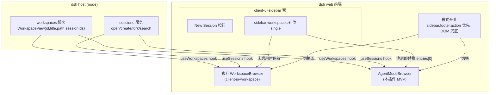
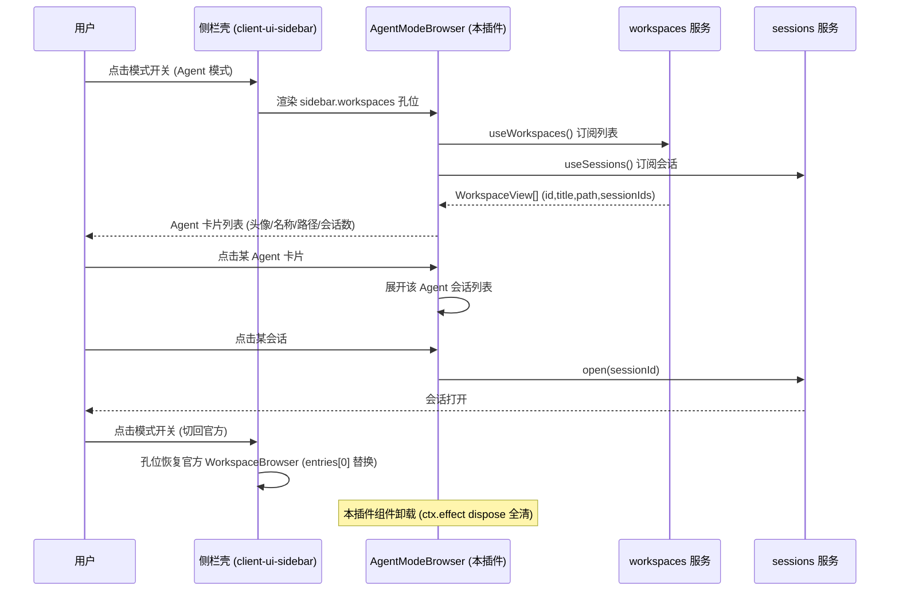

# dsh-dev-agent-mode 设计文档：左侧对话栏 Agent 模式

> 把 DeepSeek Harness 左侧对话分类栏从「按 workspace 分组」切换为「拟人化 Agent 视角」的插件设计。
> 状态：**设计稿 + MVP 已实现**（M2/M3 完成：packages/dsh-dev-agent-mode，20/20 单测 + 13/13 浏览器冒烟通过，已装进 web profile bundle）

## 1. 背景与目标

**现状**：dsh web 左侧栏是「Workspace 浏览器」（`sidebar.workspaces` 孔位，官方 `client-ui-workspace` 的
`WorkspaceBrowser` 实现）——按 host workspace（目录）分组，组内列出会话。每个 workspace 是一个文件夹图标 + 标题 + 会话列表。

**诉求**：将对话拟人化为多个 **Agent**——每个 workspace 对应一个 Agent，有头像、名称、个性/能力描述；
workspace 只是该 Agent 的一个「标签」（cwd 属性）。用户通过左侧栏切换 Agent，像在「角色选择器」里切换。

**目标**：
- 左侧栏在 Agent 模式下，每个 workspace 渲染为一个 **Agent 卡片**：头像（确定性生成，如路径 hash → 颜色/首字母）、
  名称（workspace 标题）、副标题（路径）、会话数、状态点。
- 点击 Agent 卡片 → 展开其会话列表（或直接进入该 workspace 的会话）。
- 支持与官方模式**一键切换**（Agent 模式 ↔ 官方 workspace 模式），且切换是**可逆、无残留**的。
- 非侵入：不 fork dsh、不打补丁，纯插件（`ctx.slots` 注入）。

## 2. 调研结论：现有左侧栏改造插件怎么做的

### 2.1 官方 slot 机制（本方案的地基）

`dsh-client-ui-sidebar` 声明 `sidebar` 壳，内部孔位：

| 孔位 | kind | 占用者 | 第三方能否注入 |
|---|---|---|---|
| `sidebar.brand.mark` / `sidebar.brand.name` | single | 官方 | 替换（replaceRisk: shadows-shipped-ui） |
| `sidebar.workspaces` | single | `client-ui-workspace` WorkspaceBrowser | **可替换**（注册即替换，`entriesOfSlot()[0]` 胜出） |
| `sidebar.settings` | single | settings-general SettingsRoot | 替换 |
| `sidebar.footer.action` | **list** | cordis-panel 等 | **可追加**（id 键控，带 position） |

关键语义（源码确认，`dsh-client-ui-renderer` 的 `renderOutletContent`）：
- single 孔位取 `entriesOfSlot(key)[0]` 渲染，**注册即整体替换**官方组件，无残留。
- slot catalog 为 `sidebar.workspaces` 标注 `replaceRisk: "shadows-shipped-ui"`，并提供第三方替换的官方示例
  （`ctx.slots.inject('sidebar.workspaces', () => ctx.slots.register({ name: 'sidebar.workspaces' }, MyComponent))`）。
- 替换组件通过 **standard props** 拿到数据 hooks：`useWorkspaces`（`SnapshotSelectorHook<WorkspaceSnapshot>`）、
  `useSessions`（`UseSessions`）、`useSessionPendingInteraction`，以及 owner props `{ wide, expandSidebar }`。
- `WorkspaceView` 数据模型：`{ workspaceId, path, title, sessionIds, createdAt, updatedAt }`。

### 2.2 现有插件的两条路线

| 插件 | 路线 | 实现 | 对我们借鉴 |
|---|---|---|---|
| `dsh-better-sidebar` (v0.17.1) | 右侧栏重写 | `ctx.slots` 注册 `conversation` / 自建 tab 体系；client `inject: [...,'dsh-client-ui-slots','dsh-client-ui-conversation']` | client 包如何声明 dsh.client.inject 与 ctx.slots |
| `@linxin666/dsh-client-ui-task-board` | **DOM 注入**（绕开 single 孔位被占） | `sidebar-entry-core.ts`：MutationObserver 自愈、幂等（rowAttribute）、family 排序，在 New Session 按钮后插一行入口 | 切换开关的 DOM 注入范式（官方孔位都占满时的兜底路线） |
| `dsh-tab-split` / `dsh-flowglass` | 布局/分屏 | 注册 `tabsplit.pane` / 主题 | 生态互操作示例 |

**结论**：两条路线都验证过——**优先走 `sidebar.workspaces` slot 替换**（官方支持的 replace 孔位，天然干净）；
DOM 注入作为**切换开关**（`sidebar.footer.action` list 孔位优先，兜底 DOM 注入）与**未启用时的零开销**保障。

## 3. 需求边界（MVP 范围）

### 3.1 In scope（MVP）

1. **Agent 拟人化**：左侧栏每个 workspace 显示为 Agent 卡片——确定性头像（workspaceId hash → 色相 + 首字母）、
   名称（= workspace.title）、路径标签、会话数徽标、运行状态点。
2. **模式切换**：一个开关在「官方模式 ↔ Agent 模式」间切换；切换后左侧栏整体换渲染，反向切换恢复官方浏览器，无残留。
3. **会话导航**：Agent 卡片展开显示其会话列表；点击会话打开；支持「新会话」入口（复用 `startSession(workspaceId)`）。
4. **数据复用**：直接用官方 hooks（`useWorkspaces`/`useSessions`），不做数据层，零同步问题。
5. **错误处理**：hook 缺失/服务未就绪时降级显示（不崩溃整个侧栏），可 fail-loud 的注册失败就 fail-loud。

### 3.2 Out of scope（后续版本）

- 编辑 Agent 头像/名称/个性（MVP 用确定性派生，不落库）。
- 每个 Agent 独立的 system prompt / 工具权限（那是 agent 层能力，与渲染解耦）。
- 拖拽排序、自定义分组、跨 workspace 会话聚合视图。
- 服务端路由/持久化（纯前端渲染，零 host 代码——MVP 目标就是「最薄」）。

### 3.3 验收标准（DoD）

1. 插件装上后，`sidebar.workspaces` 被本插件组件替换；未启用开关时，官方浏览器**原样**工作。
2. 开关切到 Agent 模式：每个 workspace 显示为带头像/名称/路径/会话数的 Agent 卡片，点击可展开会话并打开。
3. 切回官方模式：官方 WorkspaceBrowser 恢复，本插件组件卸载干净（无残留 DOM/监听）。
4. `pnpm typecheck` 通过；`pnpm build` 产出 lib/；测试套件（node:test）通过。

## 4. MVP 架构



### 4.1 组件与数据流



### 4.2 包结构（沿用 dsh-dev-* 系列命名，见项目记忆）

```
packages/dsh-dev-agent-mode/
├── src/
│   ├── index.ts            # host 入口：name/inject/apply（薄壳，本 MVP 无 host 逻辑，仅透传）
│   ├── client.js           # web 客户端（IIFE，window.__ModuleLoader__.load，仿 dsh-dev-git-graph）
│   ├── agent-identity.ts   # 纯函数：workspaceId -> {色相, 首字母, 渐变色}（可单测）
│   └── mode-store.ts       # 模式状态（localStorage + 内存）与订阅（可单测）
├── test/
│   ├── agent-identity.test.js   # 头像派生确定性/碰撞率
│   └── mode-store.test.js       # 切换状态机/持久化/错误
├── cordis.patch.yml        # insert 本插件 entry
├── package.json            # dsh.bundle.patch + dsh.client.inject
├── tsconfig.json
└── README.md
```

### 4.3 关键类型（TypeScript 视角）

```ts
/** 来自官方 slot standard props（client-ui-workspace 契约）。 */
interface WorkspaceView {
  workspaceId: string
  path: string
  title: string
  sessionIds: readonly string[]
  createdAt: string
  updatedAt: string
}

interface AgentIdentity {
  /** 确定性头像：hue 由 workspaceId hash 决定，同一 id 永远同一头像。 */
  hue: number
  /** 头像首字母：title 首个非空白字符的大写，无标题时用 workspaceId 首字符。 */
  initial: string
  /** 渐变色：hue + 固定 S/L 的组合，用于卡片头像背景。 */
  gradient: string
}

type AgentMode = 'official' | 'agent'

interface ModeStore {
  get(): AgentMode
  set(mode: AgentMode): void
  subscribe(listener: () => void): () => void
}
```

### 4.4 错误处理策略

| 场景 | 行为 |
|---|---|
| `useWorkspaces`/`useSessions` 未注入（hook 缺失） | 组件显示降级提示 + 错误边界兜底，不崩整个侧栏 |
| 模式存储读写失败（localStorage 不可用） | 内存态兜底，仍可切换（刷新后回官方模式，可接受） |
| slot 注册失败（被他人占用/签名不符） | fail-loud：`ctx.effect` 抛错，profile 加载失败可见（开发期暴露） |
| 会话打开失败（sessionId 失效） | 捕获异常，卡片状态不崩，可重试 |

## 5. 与现有插件生态的接口

- **前置依赖**：无（独立插件，不依赖 better-sidebar/tab-split）。
- **数据**：完全走官方 `workspaces` / `sessions` client 服务（`dsh.client.inject` 声明
  `@deepseek-ai/dsh-client-connection`、`dsh-client-ui-renderer` 等，与 ui-workspace 同源）。
- **主题**：沿用 `--dsw-alias-*` CSS 变量（与官方列表同款视觉语言），自动适配亮/暗。

## 6. 测试策略（node:test，零额外依赖）

1. `agent-identity`：确定性（同 id 同输出）、碰撞率（1000 个 id 的 hue 分布）、首字母提取边界（空标题/数字开头/中文）。
2. `mode-store`：默认 official、set→get 往返、订阅触发、localStorage 损坏时回退内存、并发 set 最后写赢。
3. 构建/类型：`pnpm typecheck` + `pnpm build`。

## 7. 里程碑

| 阶段 | 内容 |
|---|---|
| M1 设计（本文档） | 调研 + 边界 + 验收标准（本任务交付） |
| M2 MVP | agent-identity + mode-store + AgentModeBrowser 渲染 + 切换开关（本任务交付） |
| M3 测试 | node:test 单测 + typecheck/build（本任务交付） |
| M4 后续 | 装进 web profile 实测；头像/名称可编辑；agent 个性注入 |

## 8. 风险与缓解

| 风险 | 缓解 |
|---|---|
| `sidebar.workspaces` 未来版本移除/改签名 | slot catalog 是官方契约（`replaceRisk` 明示可替换）；替换失败 fail-loud，插件卸载即恢复官方 |
| 与 task-board 的 DOM 注入入口冲突 | 我们优先用 `sidebar.footer.action` list 孔位（task-board 用 DOM 注入，互不冲突）；DOM 兜底时复用 family 排序 |
| localStorage 模式状态与多标签页不同步 | MVP 接受（模式是全局偏好）；订阅 `storage` 事件同步为后续优化 |
| 会话/workspace 数据量大导致列表卡顿 | 复用官方 `useSessions` 快照 + 卡片只读投影，不做每 Agent 全量渲染 |

## 9. 一句话总结

**用官方 `sidebar.workspaces` 孔位的「注册即替换」语义，做一个纯前端的 Agent 模式浏览器：workspace → Agent（确定性头像+名称+路径），开关切换，零 host 代码、零持久化，卸载即还原。**

## 10. MVP 实现记录（M2/M3 完成）

### 已交付

| 交付物 | 位置 | 说明 |
|---|---|---|
| 设计文档 | `docs/DESIGN-dsh-dev-agent-mode.md` | 本文档 |
| host 薄壳 | `packages/dsh-dev-agent-mode/src/index.ts` | name/inject/apply 三件套，无副作用 |
| 纯函数身份派生 | `packages/dsh-dev-agent-mode/src/agent-identity.js` | FNV-1a → 色相 + 首字母 + 渐变（可单测） |
| 模式状态机 | `packages/dsh-dev-agent-mode/src/mode-store.js` | localStorage + 内存兜底 + 订阅（可单测） |
| 客户端渲染 | `packages/dsh-dev-agent-mode/src/client.js` | IIFE：注册 `sidebar.workspaces` + `sidebar.footer.action` + DOM 兜底 |
| 单测 | `packages/dsh-dev-agent-mode/test/*.test.js` | 20 例（node:test） |
| 浏览器冒烟 | `packages/dsh-dev-agent-mode/test/smoke.html` | 13 项断言全过（模拟 __ModuleLoader__ + 假 ctx + React 渲染两种模式） |
| 安装 | web profile bundle index 24 | `dsh plugin add file:...` 成功，patch reconcile 进 bundles |

### 验证结果

- `pnpm --filter dsh-dev-agent-mode test`：**20/20 通过**（node:test）
- `tsc --noEmit`：**typecheck 通过**
- `node --check`：全部 JS 语法通过
- `test/smoke.html`（headless 浏览器）：**15/15 通过**——含 priority 遮蔽语义：同 priority=0 双注册 throw、priority=-1 遮蔽官方、dispose 后官方恢复、动态切换（official→agent 注册 -1 / agent→official 注销）、Agent 卡片渲染（头像/名称/会话数）、展开会话、打开会话、新建会话
- `dsh plugin --profile web add`：**安装成功**，bundle 层已含 `dsh-dev-agent-mode`

### 踩坑记录

1. **single 孔位 priority 遮蔽机制（最重要）**：`sidebar.workspaces` 同一 priority 只允许一个注册者——官方 `client-ui-workspace` 以 priority=0 注册，第三方**再以 priority=0 注册会直接 throw**（`SlotCore.register` 源码：`single slot "..." already has a registration — register at a different priority to shadow it (lowest renders)`）。正确做法：**用 `priority: -1` 遮蔽官方**（排序 `(a,b)=>(a.priority??0)-(b.priority??0)` 升序，priority 最小排 [0]，渲染取 `entriesOfSlot()[0]`）；切回官方 = **dispose 自己的 entry**，官方 priority=0 自动恢复 [0]，无需自建精简等价物。better-sidebar 已用此惯例（`conversation.chat.turnTail` 用 priority: -1/-50/-100）。
2. **client.js factory 顶层不能访问 ctx**：CSS 注入初版写在 factory 顶层，`ctx.effect` 直接 ReferenceError——已移入 `apply(ctx)` 内。
3. **dsh 环境 node 25 的 simdjson dylib 缺失**：`/opt/homebrew/Cellar/node/25.5.0` 的 node 全坏，用 `/opt/homebrew/opt/node@22/bin/node` 跑 pnpm/tsc/dsh。
4. **pnpm 11 verify-deps 触发 `pnpm install`（用坏 node）**：绕过方式是用 node@22 直接跑 `node_modules/typescript/lib/tsc.js`，或 PATH 前置 node@22 跑 pnpm。
5. **dsh plugin add 需要写 profile**：sandbox 默认拒写 `~/.dsh/profiles/web`，需 `danger-full-access` 提权后成功。
6. **client.inject 必须用服务名**（`slots`），不是包名——参考 git-graph 的 `["sessions","slots","betterSidebar"]`。

### 后续（M4+）

- 装进 web profile 后重启 dsh 实测左侧栏两种模式切换；
- Agent 头像/名称/个性可编辑（落库 + 设置页）；
- Agent 独有 system prompt / 工具权限（agent 层能力）；
