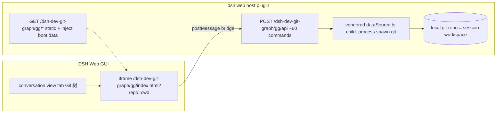

# dsh-dev-git-graph

A [DeepSeek Harness](https://github.com/DeepSeek-ai/deepseek-harness) (dsh) plugin that adds a **Git Graph panel** to every conversation tab in the DSH Web GUI — a faithful port of [mhutchie/vscode-git-graph](https://github.com/mhutchie/vscode-git-graph) 1.30.0.

It automatically binds to the **current session's workspace** and renders the commit graph (branch lanes, commit messages, dates, authors, refs), with the full set of git operations from the original extension available via right-click: checkout, merge, rebase, push/pull, tag, stash, and more.

[中文文档](README.zh.md)

## Features

- **Session tab**: a "Git 树" tab appears alongside Chat / Trajectory for any conversation with a workspace.
- **Auto-bound repo**: the graph is loaded for the session's working directory; no manual repo selection needed.
- **Full git operations**: checkout, cherry-pick, revert, merge, rebase, push, fetch, tag, stash — driven by the original extension's ~60 commands, executed directly against your local git.
- **Theming**: maps DSH design tokens (`--dsw-alias-*`) onto the graph UI; follows the host's light / dark mode.
- **No external processes**: the host runs `git` directly via `child_process.spawn` (array args, no shell injection) and serves the frontend same-origin.

## Install

```sh
dsh plugin --profile web add dsh-dev-git-graph
# restart `dsh web`, then open any conversation — a "Git 树" tab shows the workspace's commit graph
```

### Better Sidebar integration (optional)

When [`dsh-better-sidebar`](https://github.com/omdsh-dev/DSH-better-sidebar) is installed, this plugin additionally registers a native **Git Graph** tab in its right sidebar (+ menu, single-instance, auto-bound to the session workspace via `scope.repoRoot`/`scope.cwd`). Without better-sidebar, everything falls back to the built-in overlay side panel + header toggle — the two can coexist.

```sh
# full one-line install (better-sidebar first, then this plugin)
cd ~/.dsh && dsh plugin --profile web add dsh-better-sidebar && dsh plugin --profile web add dsh-dev-git-graph
```

## How it works



- **Static**: `GET /dsh-dev-git-graph/gg/` serves the bundled frontend (`media/`), injecting `window.__DSH_GG_BOOT__` with `{ apiBase, repo, initialState, ... }`.
- **API**: `POST /dsh-dev-git-graph/gg/api` mirrors the original extension's `gitGraphView.respondToMessage` command set.
- **Data**: `vendor/git-graph/dataSource.ts` runs git via `child_process.spawn` with array arguments.

## Differences from vscode-git-graph

| Area | Behaviour |
|---|---|
| VS Code-only commands | `openFile` / `viewDiff` / `openTerminal` / `createPullRequest` / `createArchive` return "not supported" |
| View state persistence | localStorage (the extension used workspaceState); `setGlobalViewState` etc. are ACKed |
| Repo source | auto-bound to the current session's workspace |

## Security

- Git is executed with **array arguments** (no shell), so repo paths / refs can't be used for shell injection.
- Static file serving sanitizes filenames against a whitelist.
- The API only acts on the repo path supplied by the host's own boot payload (the session cwd).

## Development

```sh
pnpm --filter dsh-dev-git-graph build      # build:web (tsc + pack) -> build:host (tsc) -> cp client.js
pnpm --filter dsh-dev-git-graph typecheck  # two tsconfigs: host (NodeNext) + web (DOM)
```

## License

MIT. The frontend and data layer are derived from **mhutchie/vscode-git-graph** (MIT), see `vendor/git-graph/LICENSE`.
